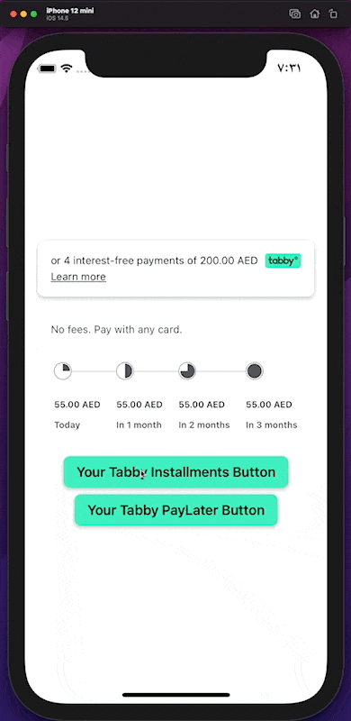
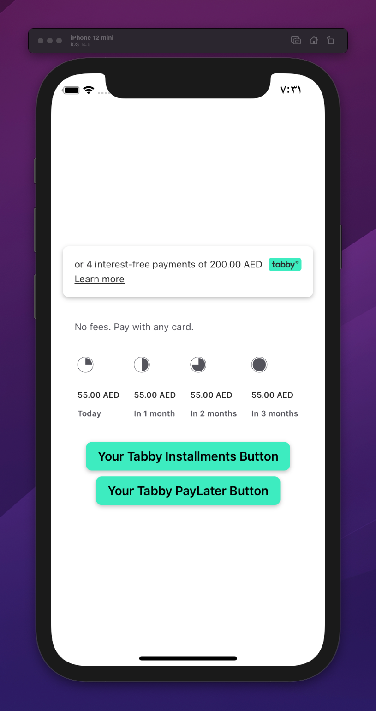
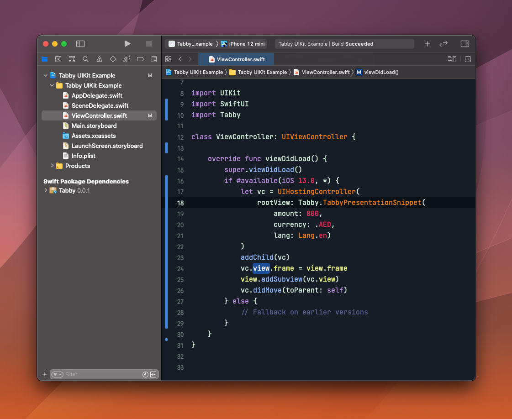
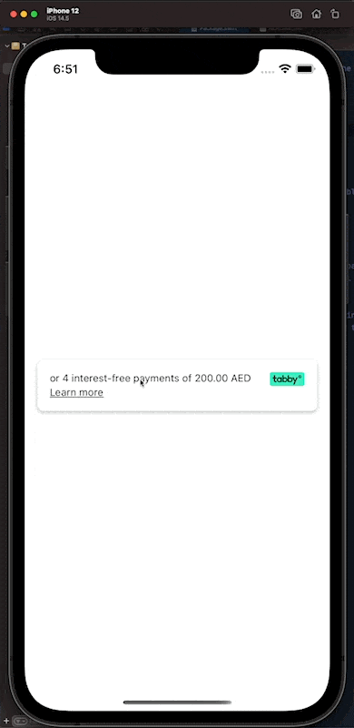
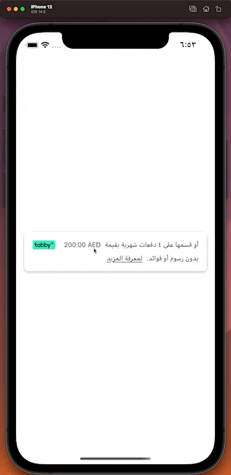
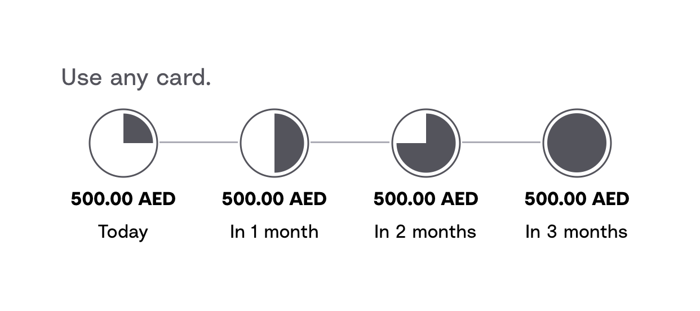
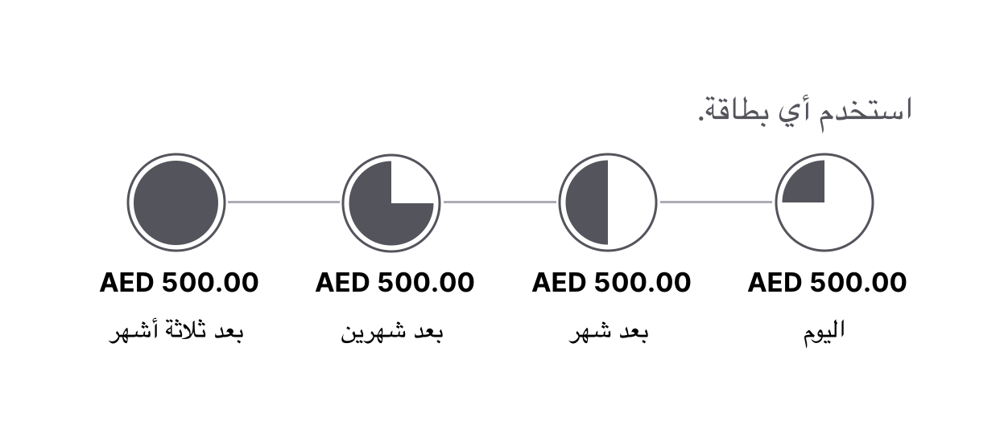

# Tabby

## Requirements

iOS 13.0+
Swift 5.3+
Xcode 12.0+

## Integration

### Swift Package Manager (recommended)

```
dependencies: [
    .package(url: "https://github.com/tabby-ai/tabby-ios-sdk.git", .upToNextMajor(from: "1.6.1"))
]

```

# SDK usage

## 0. Please make sure you've added in your `Info.plist`

Feel free to edit descriptions according to your App

```xml
<key>NSCameraUsageDescription</key>
<string>This allows Tabby to take a photo</string>
<key>NSPhotoLibraryUsageDescription</key>
<string>This allows Tabby to select a photo</string>
<key>NSMicrophoneUsageDescription</key>
<string>For secure verification on the checkout step</string>
```

## 1. Init Tabby when your app starts (AppDelegete or @main)

`TabbySDK.shared.setup(withApiKey: "__API_KEY_HERE__")`

## 2. Prepare view

```swift
import Tabby

let customerPayment = Payment(
    amount: "340",
    currency: .AED,
    description: "tabby Store Order #3",
    buyer: Buyer(
        email: "successful.payment@tabby.ai",
        phone: "500000001",
        name: "Yazan Khalid",
        dob: nil
    ),
    buyer_history: BuyerHistory(registered_since: "2019-08-24T14:15:22Z", loyalty_level: 0),
    order: Order(
        reference_id: "#xxxx-xxxxxx-xxxx",
        items: [
            OrderItem(
                description: "Jersey",
                product_url: "https://tabby.store/p/SKU123",
                quantity: 1,
                reference_id: "SKU123",
                title: "Pink jersey",
                unit_price: "300",
                category: "Clothes"
            )],
        shipping_amount: "50",
        tax_amount: "100"
    ),
    order_history: [],
    shipping_address: ShippingAddress(
        address: "Sample Address #2",
        city: "Dubai",
        zip: "01234"
    )
)

let myTestPayment = TabbyCheckoutPayload(merchant_code: "ae", lang: .en, payment: customerPayment)

...
in your CartScreenView etc in .onAppear or viewDidLoad
...
.onAppear() {
    TabbySDK.shared.configure(forPayment: myTestPayment) { result in
        switch result {
        case .success(let s):
            // 1. Do something with sessionId (this step is optional)
            print("sessionId: \(s.sessionId)")
            // 2. Do something with paymentId (this step is optional)
            print("paymentId: \(s.paymentId)")
            // 2. Grab avaibable products from session and enable proper
            // payment method buttons in your UI (this step is required)
            print("tabby available products: \(s.tabbyProductTypes)")
            if (s.tabbyProductTypes.contains(.installments)) {
                self.isTabbyInstallmentsAvailable = true
            }
        case .failure(let error):
            // Do something when Tabby checkout session POST requiest failed
            print(error)
        }
    }
}
```

## 3. Launch Tabby checkout

SDK is built for your convenience - once `TabbySDK.shared.configure(forPayment: myTestPayment) { result in ... }` is called - you can render something like this
if modal / sheet / seguway / NavigationLink / ViewController etc - whatever fits your UI and app structure. With both SwiftUI and UIKit

```swift
.sheet(isPresented: $isTabbyOpened, content: {
    TabbyCheckout(productType: openedProduct, onResult: { result in
        print("TABBY RESULT: \(result) !")
        switch result {
        case .authorized:
            // Do something else when Tabby authorized customer
            // probably navigation back to Home screen, refetching, etc.
            self.isTabbyOpened = false
            break
        case .rejected:
            // Do something else when Tabby rejected customer
            self.isTabbyOpened = false
            break
        case .close:
            // Do something else when customer closed Tabby checkout
            self.isTabbyOpened = false
            break
        case .expired:
            // Do something else when session expired
            // We strongly recommend to create new session here by calling
            // TabbySDK.shared.configure(forPayment: myTestPayment) { result in ... }
            self.isTabbyOpened = false
            break
        }
    })
})
```



### Full example code goes here

```swift

struct CheckoutExampleWithTabby: View {
    @State var isTabbyInstallmentsAvailable = false

    @State var openedProduct: TabbyProductType = .installments
    @State var isTabbyOpened: Bool = false

    var body: some View {
        VStack {
            Button(action: {
                openedProduct = .installments
                isTabbyOpened = true
            }, label: {
                HStack {
                    Text("My Tabby 'Installments' fancy Button")
                        .font(.headline)
                        .foregroundColor(isTabbyInstallmentsAvailable ? .black : .white)
                }
            })
            .disabled(!isTabbyInstallmentsAvailable)

        }
        .sheet(isPresented: $isTabbyOpened, content: {
            TabbyCheckout(productType: openedProduct, onResult: { result in
                print("TABBY RESULT: \(result)!!!")
                switch result {
                case .authorized:
                    // Do something else when Tabby authorized customer
                    // probably navigation back to Home screen, refetching, etc.
                    self.isTabbyOpened = false
                    break
                case .rejected:
                    // Do something else when Tabby rejected customer
                    self.isTabbyOpened = false
                    break
                case .close:
                    // Do something else when customer closed Tabby checkout
                    self.isTabbyOpened = false
                    break
                case .expired:
                    // Do something else when session expired
                    // We strongly recommend to create new session here by calling
                    // TabbySDK.shared.configure(forPayment: myTestPayment) { result in ... }
                    self.isTabbyOpened = false
                    break
                }
            })
        })
        .onAppear() {
            TabbySDK.shared.configure(forPayment: myTestPayment) { result in
                switch result {
                case .success(let s):
                    // 1. Do something with sessionId (this step is optional)
                    print("sessionId: \(s.sessionId)")
                    // 2. Do something with paymentId (this step is optional)
                    print("paymentId: \(s.paymentId)")
                    // 3. Grab avaibable products from session and enable proper
                    // payment method buttons in your UI (this step is required)
                    // Feel free to ignore products you don't need or don't want to handle in your App
                    print("tabby available products: \(s.tabbyProductTypes)")
                    // If you want to handle installments product - check for .installments in response
                    if (s.tabbyProductTypes.contains(.installments)) {
                        self.isTabbyInstallmentsAvailable = true
                    }
                case .failure(let error):
                    // Do something when Tabby checkout session POST requiest failed
                    print(error)
                }
            }
        }
    }
}
```



## Snippets usage

### Before you go add to your `Info.plist`.

```
<key>CFBundleAllowMixedLocalizations</key>
<true/>
```

This is required to enable Arabic locale in your snippets.

### TabbyPresentationSnippet

```swift
import UIKit
import SwiftUI
import Tabby

class ViewController: UIViewController {
    override func viewDidLoad() {
        super.viewDidLoad()
        if #available(iOS 13.0, *) {
            let vc = UIHostingController(
                rootView: Tabby.TabbyProductPageSnippet(amount: 1990, currency: .SAR)
            )
            addChild(vc)
            vc.view.frame = view.frame
            view.addSubview(vc.view)
            vc.didMove(toParent: self)
        } else {
            // Fallback on earlier versions
        }
    }
}
```

<!--  -->

## Result




### TabbyCheckoutSnippet

```swift
import UIKit
import SwiftUI
import Tabby

class ViewController: UIViewController {
    override func viewDidLoad() {
        super.viewDidLoad()
        if #available(iOS 13.0, *) {
            let vc = UIHostingController(
                rootView: Tabby.TabbyCheckoutSnippet(amount: 2000, currency: .AED)
            )
            addChild(vc)
            vc.view.frame = view.frame
            view.addSubview(vc.view)
            vc.didMove(toParent: self)
        } else {
            // Fallback on earlier versions
        }
    }
}
```

## Result



